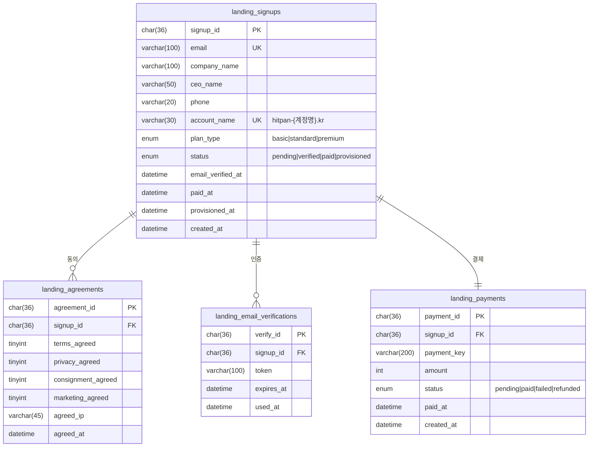

# 히트판 통합 ERD — 3개 시스템

> 작성일: 2026-05-06 | MariaDB 11.4 / utf8mb4_unicode_ci

---

## 시스템 경계 및 데이터 흐름

```
┌─────────────────────────────────────────────────────────────────┐
│  [랜딩페이지 DB]          [백오피스 DB]          [ERP DB]         │
│                                                                  │
│  landing_signups    →    tenants          ←─Pull─  users        │
│  landing_agreements →    subscriptions             tenant_devices│
│                     →    billing_keys                            │
│                     →    billing_invoices                        │
│                          resellers                               │
│                          reseller_accounts                       │
│                          reseller_commissions                    │
│                          commission_settlements                  │
│                          tenant_employees  ←─Pull─  users       │
│                          tenant_devices    ←─Pull─  tenant_devic│
│                          provisioning_jobs                       │
│                          agreement_versions                      │
└─────────────────────────────────────────────────────────────────┘

범례:
  →  즉시 Push (가입·결제 시)
  ←Pull─  5분 주기 백오피스 스케줄러가 ERP에서 수집
```

---

## 1. 랜딩페이지 ERD



---

## 2. 백오피스 ERD

```mermaid
erDiagram
    tenants {
        char(36)     tenant_id       PK
        char(36)     reseller_id     FK "NULL=직계약"
        varchar(20)  tenant_code     UK
        varchar(100) company_name
        varchar(12)  biz_no
        varchar(50)  ceo_name
        varchar(20)  tel
        varchar(200) address
        varchar(30)  account_name    "hitpan-{계정명}.kr"
        enum         status          "active|suspended|trial|cancelled"
        varchar(100) db_host
        varchar(50)  db_name
        varchar(256) license_key_hash
        datetime     trial_ends_at
        datetime     created_at
        datetime     updated_at
    }

    subscriptions {
        char(36)     subscription_id PK
        char(36)     tenant_id       FK
        enum         plan_type       "basic|standard|premium"
        int          base_fee
        enum         billing_cycle   "monthly|yearly"
        date         started_at
        date         next_billing_at
        enum         status          "active|paused|cancelled"
        datetime     created_at
    }

    billing_keys {
        char(36)     billing_key_id  PK
        char(36)     tenant_id       FK
        enum         provider        "toss|kakao"
        varchar(200) billing_key     "AES-256 암호화"
        varchar(20)  masked_no
        tinyint      is_default
        tinyint      is_active
        date         expired_at
    }

    billing_invoices {
        char(36)     invoice_id      PK
        char(36)     tenant_id       FK
        char(36)     subscription_id FK
        char(7)      billing_month   UK "YYYY-MM"
        int          total_amount
        enum         status          "pending|paid|failed|refunded"
        datetime     paid_at
        varchar(200) payment_key
    }

    provisioning_jobs {
        char(36)     job_id          PK
        char(36)     tenant_id       FK
        enum         status          "queued|running|done|failed"
        varchar(100) domain          "hitpan-{계정명}.kr"
        varchar(36)  tunnel_id
        text         credentials_json "암호화 저장"
        varchar(36)  license_key
        int          retry_count
        text         error_message
        datetime     completed_at
        datetime     created_at
    }

    platform_admins {
        char(36)     admin_id        PK
        varchar(100) email           UK
        varchar(256) password_hash
        varchar(50)  admin_name
        enum         role            "super_admin|billing_admin|cs_admin|readonly"
        tinyint      is_active
        datetime     last_login_at
    }

    resellers {
        char(36)     reseller_id     PK
        varchar(20)  reseller_code   UK
        varchar(100) reseller_name
        varchar(12)  biz_no          UK
        varchar(50)  ceo_name
        varchar(500) bank_account    "AES-256 암호화"
        enum         status          "active|suspended|terminated"
        date         join_date
    }

    reseller_accounts {
        char(36)     account_id      PK
        char(36)     reseller_id     FK
        varchar(100) email
        varchar(256) password_hash
        enum         role            "reseller_admin|reseller_user"
        tinyint      is_active
    }

    reseller_commissions {
        char(36)     commission_id   PK
        char(36)     reseller_id     FK
        varchar(20)  plan_code
        decimal(5_2) rate
        date         effective_from
        date         effective_to
    }

    commission_settlements {
        char(36)     settlement_id   PK
        char(36)     reseller_id     FK
        char(36)     approved_by     FK
        char(7)      settlement_month UK "YYYY-MM"
        enum         status          "draft|approved|paid|cancelled"
        decimal(15_2) total_revenue
        decimal(15_2) total_commission
        decimal(15_2) payment_amount
        date         payment_date
    }

    tenant_employees {
        bigint       id              PK
        char(36)     tenant_id       FK
        varchar(100) email
        varchar(50)  user_name
        varchar(30)  position
        tinyint      is_active
        datetime     synced_at       "마지막 Pull 시각"
    }

    tenant_devices {
        bigint       id              PK
        char(36)     tenant_id       FK
        varchar(100) device_id
        varchar(100) device_name
        date         registered_at
        datetime     synced_at       "마지막 Pull 시각"
    }

    agreement_versions {
        int          id              PK
        varchar(10)  terms_version
        varchar(10)  privacy_version
        varchar(10)  consignment_version
        tinyint      is_current
        date         effective_date
    }

    tenants ||--o{ subscriptions : "구독"
    tenants ||--o{ billing_keys : "결제수단"
    tenants ||--o{ billing_invoices : "청구서"
    tenants ||--o{ provisioning_jobs : "프로비저닝"
    tenants ||--o{ tenant_employees : "직원Pull"
    tenants ||--o{ tenant_devices : "기기Pull"
    tenants }o--|| resellers : "담당대리점"
    resellers ||--o{ reseller_accounts : "계정"
    resellers ||--o{ reseller_commissions : "수수료정책"
    resellers ||--o{ commission_settlements : "정산"
    platform_admins ||--o{ commission_settlements : "승인"
    subscriptions ||--o{ billing_invoices : "청구"
```



---

## 3. 히트판 ERP ERD

```mermaid
erDiagram
    tenants {
        char(36)     tenant_id       PK
        varchar(100) company_name
        varchar(12)  biz_no
        varchar(50)  ceo_name
        enum         status
        datetime     created_at
    }

    users {
        char(36)     user_id         PK
        char(36)     tenant_id       FK
        char(36)     dept_id         FK
        varchar(100) email
        varchar(256) password_hash
        varchar(50)  user_name
        enum         role            "tenant_admin|manager|user|readonly"
        tinyint      is_active
        datetime     last_login_at
    }

    user_agreements {
        bigint       id              PK
        char(36)     tenant_id       FK
        char(36)     user_id         FK
        int          agreement_version_id FK
        tinyint      terms_agreed
        tinyint      privacy_agreed
        tinyint      consignment_agreed
        tinyint      age_confirmed
        tinyint      marketing_agreed
        varchar(45)  agreed_ip
        datetime     agreed_at
    }

    agreement_versions {
        int          id              PK
        varchar(10)  terms_version
        varchar(10)  privacy_version
        tinyint      is_current
        date         effective_date
    }

    tenant_devices {
        char(36)     device_id       PK
        char(36)     tenant_id       FK
        varchar(100) device_name
        varchar(200) fingerprint     "AES-256"
        tinyint      is_active
        datetime     registered_at
    }

    departments {
        char(36)     dept_id         PK
        char(36)     tenant_id       FK
        char(36)     parent_dept_id  FK "자기참조"
        varchar(50)  dept_name
        tinyint      is_active
    }

    partners {
        char(36)     partner_id      PK
        char(36)     tenant_id       FK
        varchar(100) partner_name
        varchar(12)  biz_no
        enum         partner_type    "buy|sell|both"
        tinyint      is_active
    }

    items {
        char(36)     item_id         PK
        char(36)     tenant_id       FK
        varchar(100) item_name
        varchar(50)  item_code       UK
        decimal(15_2) unit_price
        decimal(15_4) stock_qty
        tinyint      is_active
    }

    bom_headers {
        char(36)     bom_id          PK
        char(36)     tenant_id       FK
        char(36)     item_id         FK "완제품"
        varchar(50)  bom_code        UK
        tinyint      is_active
    }

    bom_items {
        char(36)     bom_item_id     PK
        char(36)     bom_id          FK
        char(36)     material_id     FK "자재 item_id"
        decimal(15_4) qty
    }

    purchase_orders {
        char(36)     order_id        PK
        char(36)     tenant_id       FK
        char(36)     partner_id      FK
        char(36)     created_by      FK
        varchar(30)  order_no        UK
        enum         status          "draft|confirmed|received|cancelled"
        date         order_date
        decimal(15_2) total_amount
    }

    purchase_order_items {
        char(36)     item_id         PK
        char(36)     order_id        FK
        char(36)     product_id      FK
        decimal(15_4) qty
        decimal(15_2) unit_price
        decimal(15_2) amount
    }

    purchase_receipts {
        char(36)     receipt_id      PK
        char(36)     tenant_id       FK
        char(36)     partner_id      FK
        char(36)     order_id        FK "NULL=직접매입"
        varchar(30)  receipt_no      UK
        enum         status          "draft|confirmed|cancelled"
        date         receipt_date
        decimal(15_2) total_amount
    }

    purchase_receipt_items {
        char(36)     item_id         PK
        char(36)     receipt_id      FK
        char(36)     product_id      FK
        decimal(15_4) qty
        decimal(15_2) unit_price
        decimal(15_2) amount
    }

    sales_orders {
        char(36)     order_id        PK
        char(36)     tenant_id       FK
        char(36)     partner_id      FK
        varchar(30)  order_no        UK
        enum         status          "draft|confirmed|delivered|cancelled"
        date         order_date
        decimal(15_2) total_amount
    }

    sales_deliveries {
        char(36)     delivery_id     PK
        char(36)     tenant_id       FK
        char(36)     partner_id      FK
        char(36)     order_id        FK "NULL=직접발행"
        char(36)     tax_invoice_id  FK
        varchar(30)  delivery_no     UK
        enum         status          "draft|confirmed|cancelled"
        date         delivery_date
        decimal(15_2) total_amount
    }

    sales_delivery_items {
        char(36)     item_id         PK
        char(36)     delivery_id     FK
        char(36)     product_id      FK
        decimal(15_4) qty
        decimal(15_2) unit_price
        decimal(15_2) amount
    }

    tax_invoices {
        char(36)     invoice_id      PK
        char(36)     tenant_id       FK
        char(36)     partner_id      FK
        varchar(30)  invoice_no      UK
        enum         status          "draft|issued|cancelled"
        date         issue_date
        decimal(15_2) supply_amount
        decimal(15_2) tax_amount
        decimal(15_2) total_amount
    }

    stock_ledger {
        bigint       ledger_id       PK "INSERT ONLY"
        char(36)     tenant_id       FK
        char(36)     item_id         FK
        enum         trx_type        "purchase|sale|return|bom|adjust"
        decimal(15_4) qty_change
        decimal(15_4) qty_after
        char(36)     ref_id          "매입/판매/BOM ID"
        datetime     trx_at
    }

    journal_entries {
        char(36)     entry_id        PK
        char(36)     tenant_id       FK
        varchar(30)  entry_no        UK
        date         entry_date
        enum         status          "draft|posted|cancelled"
        varchar(200) description
    }

    journal_lines {
        bigint       line_id         PK "INSERT ONLY"
        char(36)     entry_id        FK
        char(36)     tenant_id       FK
        varchar(20)  account_code
        decimal(15_2) debit
        decimal(15_2) credit
    }

    tenants ||--o{ users : "사용자"
    tenants ||--o{ tenant_devices : "기기"
    tenants ||--o{ departments : "부서"
    tenants ||--o{ partners : "거래처"
    tenants ||--o{ items : "상품"
    tenants ||--o{ purchase_orders : "발주"
    tenants ||--o{ purchase_receipts : "매입"
    tenants ||--o{ sales_orders : "수주"
    tenants ||--o{ sales_deliveries : "거래명세서"
    tenants ||--o{ tax_invoices : "세금계산서"
    tenants ||--o{ stock_ledger : "재고원장"
    tenants ||--o{ journal_entries : "회계"
    users ||--o{ user_agreements : "약관동의"
    agreement_versions ||--o{ user_agreements : "버전"
    departments ||--o{ users : "소속"
    departments ||--o{ departments : "상위부서"
    items ||--o{ bom_headers : "완제품BOM"
    bom_headers ||--o{ bom_items : "자재"
    items ||--o{ bom_items : "자재"
    partners ||--o{ purchase_orders : "매입처"
    partners ||--o{ purchase_receipts : "매입처"
    partners ||--o{ sales_orders : "매출처"
    partners ||--o{ sales_deliveries : "매출처"
    partners ||--o{ tax_invoices : "거래처"
    purchase_orders ||--o{ purchase_order_items : "발주품목"
    purchase_orders ||--o{ purchase_receipts : "매입전환"
    purchase_receipts ||--o{ purchase_receipt_items : "매입품목"
    sales_orders ||--o{ sales_delivery_items : "판매품목"
    sales_deliveries ||--o{ sales_delivery_items : "명세품목"
    sales_deliveries }o--|| tax_invoices : "계산서"
    items ||--o{ stock_ledger : "재고이동"
    journal_entries ||--o{ journal_lines : "분개"
```



---

## 4. 시스템 간 데이터 연결

```
[랜딩페이지]                    [백오피스]
landing_signups.email    →→→  tenants.email (가입 시 Push)
landing_payments         →→→  billing_invoices (결제 시 Push)
landing_signups          →→→  provisioning_jobs (프로비저닝 트리거)

[ERP]                           [백오피스]
users (이름·이메일·직급) →Pull→ tenant_employees (5분 주기)
tenant_devices           →Pull→ tenant_devices (5분 주기)

[ERP]                           [백오피스]
구독결제 변경            →→→   subscriptions (즉시 Push)

절대 금지:
  ERP 업무 데이터 (매입/판매/원장/재고) → 백오피스 전송 금지
```
