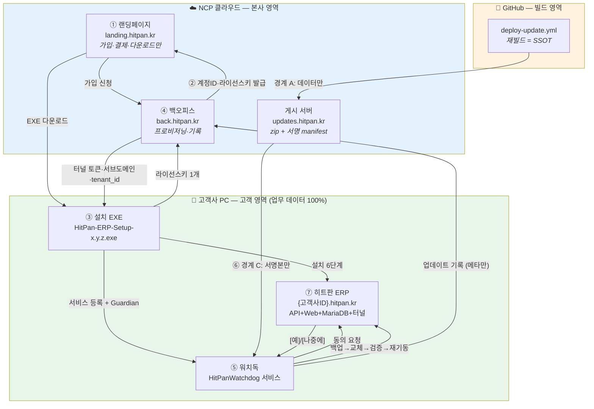

# 히트판 ERP — 배포 종단 최종설계서

> **상태**: 🟢 진실원 (배포 종단 체인 전체에 대한 단일 설계 기준)
> **작성**: 설계팀장 존 (풀스택 매니저, MS 설계팀장 출신)
> **작성일**: 2026-08-07
> **대상**: 랜딩 가입 → ERP 계정 → 설치 EXE → 백오피스 → 워치독 → 자동업데이트 → ERP 반영 (7단계 종단)
> **계기**: 2026-08-06 워치독 종단 + 자동업데이트 실측(1.2.55) 통과. 코드 수정이 아닌 **설계 최종 점검과 문서화**.
> **분류 근거**: [`docs/CATEGORIES.md`](../../CATEGORIES.md) ③ "어떻게 만들지" = 설계. 종단 전체이나 **인계 구멍이 전부 업데이트 구간에 몰려 있어** `업데이트배포/`에 둔다.

---

## 근거 문서 (참조식 — 내용을 옮겨 적지 않는다)

| 구분 | 문서 | 이 설계서에서의 역할 |
|---|---|---|
| 설계 | [`20260724_UPDATE자동화_근본틀_설계종합_11인워크플로우.md`](20260724_UPDATE자동화_근본틀_설계종합_11인워크플로우.md) | 신뢰경계 A·B·C, B-1~B-17 구멍 목록 |
| 설계 | [`20260629_고리4_마이그롤백_원자적복원_설계서.md`](20260629_고리4_마이그롤백_원자적복원_설계서.md) | 원자적 롤백 상태머신, V1~V4·R1~R8 |
| 설계 | [`../설치배포/20260730_설치6단계_관측성_설계서.md`](../설치배포/20260730_설치6단계_관측성_설계서.md) | `ExecLogged` 관측성 계약, 설치 6단계 번호 체계 |
| 설계 | [`../설치배포/INSTALLER_INNO_VELOPACK_SKELETON.md`](../설치배포/INSTALLER_INNO_VELOPACK_SKELETON.md) | 설치 골격 초기안 (⚠️ 현행과 불일치 — §7 참조) |
| 설계 | [`../erp/THREE_SYSTEM_ARCHITECTURE.md`](../erp/THREE_SYSTEM_ARCHITECTURE.md) · [`../erp/PRD_THREE_SYSTEMS.md`](../erp/PRD_THREE_SYSTEMS.md) | 헌법 #35 3시스템 분리·연결 |
| 운영기록 | `20260803작1`·`20260803작2`·`20260804작1`·`20260804작2` | 설치 터널·테넌트 격리·Guardian 순서·Y/N 동의 |
| 운영기록 | `20260806작1`·`작3`·`작4`·`작5`·`작6`·`작7` | 즉시적용·W4-3·백오피스 수신부·진범확정·W4-3-H·안내화면 |
| 운영기록 | [`20260803_일일작업보고서.md`](../../운영기록/20260803_일일작업보고서.md) | 이월 7건, CI 게이트 C-1~C-3 |

**실물 코드 확인 기준 커밋**: `e8ebc48` (W4-3-H) + 미커밋 3파일(`AppVersionController.cs`, `UpdateProgressOverlay.razor(.css)`, `UpdateConsentGate.razor` 수정분).

---

# §1. 배포 종단 체인 전체 아키텍처

## 1-1. 7단계 개관



## 1-2. 단계별 책임 주체 · 입출력 · 신뢰경계

| # | 단계 | 책임 주체 | 입력 | 출력 | 신뢰경계 |
|---|---|---|---|---|---|
| ① | **랜딩 가입** | 랜딩페이지 (NCP) | 사업자번호·회사정보 | 가입 신청 → 백오피스 Push | 공개 인터넷 → 본사 |
| ② | **ERP 계정 발급** | 백오피스 (NCP) | 가입 신청 | `tenant_id`, `license_key`, `license_key_hash`, 서브도메인 | 본사 내부 |
| ③ | **설치 EXE** | 고객사 PC (Inno Setup) | 라이선스 키 **1개뿐** | 설치된 ERP + 터널 + 워치독 | **본사 → 고객 PC (1회성)** |
| ④ | **프로비저닝·기록** | 백오피스 (NCP) | 라이선스 키 | 터널 토큰, 서브도메인, `tenant_id` / 업데이트 기록 수신 | 고객 PC ↔ 본사 (메타만) |
| ⑤ | **워치독** | 고객사 PC (Windows 서비스) | manifest 폴링 | 업데이트 적용·롤백·복구 | 고객 PC 내부 |
| ⑥ | **자동업데이트** | GitHub CI → NCP → 워치독 | 커밋 + 버전 인자 | 서명된 zip + manifest | **경계 A/B/C (§1-3)** |
| ⑦ | **ERP 반영** | 고객사 PC (API+Web) | 교체된 파일 | 새 버전 가동 + 화면 복귀 | 고객 PC 내부 |

## 1-3. 신뢰경계 3원칙 (설계 근본틀 §1-1 계승 — 이번 점검에서 **위반 0건** 확인)

```
경계 A  GitHub → NCP     : 데이터만 통과 (zip · 미서명 manifest)
                           ⛔ 개인키 · 실행 셸 · 오버라이드 인자 통과 금지
                           ✅ publish-update.sh:87-89 sudo 컨텍스트 감지 시 die

경계 B  NCP 내부          : 서명 · 교체 · 롤백 = 개인키가 사는 곳에서만
                           ✅ /var/hitpan/update-keys/update_private.pem (600 root)
                           ✅ sign-manifest.sh 단일 출처 (publish-update.sh:107-110 source)

경계 C  NCP → 고객 PC     : 서명본만. 공개키는 EXE 내장(유출 무해), 오프라인 검증
                           ✅ UpdateSignatureVerifier.cs:54 kid="upd-v1" 내장
                           ✅ UpdateClient.cs:90-91 검증 실패 → 즉시 null (fail-closed)
                           ✅ 검증이 버전 비교보다 앞 (서명 없는 매니페스트는 읽지도 않는다)
```

**설계자 판정**: 경계 3개 모두 코드 실물에서 성립. 특히 **경계 C가 버전 비교보다 앞에 있다**는 점이 중요하다 — 순서가 반대면 위조 매니페스트가 다운그레이드 게이트를 먼저 통과한다.

## 1-4. 자동업데이트 구간 상세 (⑥ → ⑦)

```
[게시]  workflow_dispatch(version, channel)
          ↓  deploy-update.yml — 커밋에서 재빌드 (승계 아님, SSOT)
          ↓  -p:HitPanVersion=x.y.z  ×3 (API·Web·Watchdog)
          ↓  중립화 게이트: ApiBaseUrl → 빈 값 (deploy-update.yml:235-304)
          ↓  시크릿 스캔 ×2 (빌드잡 :373-426 / 배포잡 :530-558)
          ↓  environment 승인 게이트 (:498)
          ↓  publish-update.sh (NCP, 경계 B)
              · 다운그레이드 게이트 (:168-205, fail-closed)
              · sha256 대조 (:155-158)
              · 서명 (kid=upd-v1)
              · ★ zip 먼저 배치 → manifest 마지막 rename (B-15 불변식, :305-310)
              · 회전 KEEP=3 (:340, 현재 버전은 카운트 제외)

[수신]  워치독 정기 루프 (Worker.cs)
          ↓  UpdateClient.GetLatestManifestAsync → {feed}/manifest.json
          ↓  ★ 서명 검증 (P1363 → DER 폴백, UpdateSignatureVerifier.cs:175-178)
          ↓  버전 비교 → 채널 분기
          ↓  Major → UpsertLatestAsync → local_update_status

[동의]  ERP 로그인 → MainLayout
          ↓  UpdateConsentGate.razor — GET api/auth/update-status
          ↓  세션가드 = **버전 문자열** (재배포 사이클 보장)
          ↓  팝업 [예] / [나중에]
          ↓  [예] → SubmitUpdateConsentAsync → local_update_consents
          ↓  ★ UpdateProgressOverlay.Start() — 꺼지기 **전에** 화면을 덮는다

[적용]  워치독 ConsumeConsentForMajorAsync (영업시간 게이트 제거됨)
          ↓  zip 다운로드 → sha256 (UpdateOrchestrator.cs:110)
          ↓  ★ 사전 백업 (mysqldump) — 실패 시 업데이트 전면 차단 (:149-158)
          ↓  ★ 마이그 교차검증 게이트 (:466~, 미적용 있으면 차단 fail-closed)
          ↓  슬롯 교체 (api / web 폴더 통교체)
          ↓  워치독은 watchdog.new 에 배치만
          ↓  schtasks /Run → SYSTEM 권한 새 API 기동
          ↓  ★ VerifyNewVersion — 60초 창, /health 200 **AND** 버전 일치 **AND** EXE FileVersion (:622-674)
          ↓  실패 → FinishWithRollbackAsync → DB 복원 + EXE 구버전 (:938-949)

[워치독 자기교체]  ── 두 경로 (§2-6)
   경로1 (W4-3, 1.2.54+ 워치독):  TryScheduleWatchdogSelfReplace (:1024-1098)
   경로2 (W4-3-H, 옛 워치독용):   새 API 가 인계 (WatchdogHandoffBootstrap.cs, Program.cs:433)

[복귀]  UpdateProgressOverlay 5초 폴링 → GET api/app-version
          ↓  버전 일치 → "✅ 업데이트가 끝났습니다" → 3초 → 자동 이동
          ↓  옛 버전이 120초 넘게 정상 응답 → 롤백 판정 → 조용히 화면 걷음 (거짓 완료 금지)

[보고]  UpdateHistoryClient → POST back.hitpan.kr/api/telemetry/update-history
          ↓  HMAC-SHA256(pepper, license_key) 대조 → 401 or 적재
          ↓  tenant_update_history (INSERT ONLY) + tenant_update_state (UPSERT)
```

---

# §2. 단계 간 인계 지점(handoff)의 계약

> 인계 지점이 곧 사고 지점이다. **무엇이 넘어가는가 / 실패하면 누가 책임지는가**를 못 정한 곳에서 8월 사고가 전부 났다.

## H-1. 랜딩 ① → 백오피스 ②

| 항목 | 내용 |
|---|---|
| **넘어가는 것** | 가입 신청 (사업자번호·회사명·연락처) |
| **방향** | 랜딩 → 백오피스 **Push** |
| **되돌아오는 것** | `tenant_id`, `license_key`(원문 1회), `license_key_hash`, 서브도메인 |
| **실패 시 책임** | 백오피스. 국세청 무응답 시 **보류 통과** (`adbfa6b`·`f934d34` — 가입 전면차단 해소) |
| **불변식** | 라이선스 키 **원문은 백오피스에 저장하지 않는다.** `License:Pepper` + `license_key_hash`만 보관 |

## H-2. 백오피스 ② → 설치 EXE ③

| 항목 | 내용 |
|---|---|
| **넘어가는 것** | 고객이 입력하는 것은 **라이선스 키 1개뿐** (`.iss` 16자 이상 검증) |
| **되돌아오는 것** | 터널 토큰(`TUNNEL_TOKEN` → `db.conf`), 서브도메인, `tenant_id` |
| **실패 시 책임** | 설치 EXE. 6단계 각 명령이 `ExecLogged`로 종료코드·출력을 기록 (관측성 설계서 계약) |
| **불변식** | **Cloudflare API 토큰은 EXE에 절대 포함하지 않는다.** 본사 서버에만 존재 |
| **⚠️ 계약 갱신** | 설치 시 `ApiBaseUrl`을 **도메인으로 채우지 않고 빈 값으로 둔다** (`.iss:1146`). 자기 출처 폴백(`Web/Program.cs:35`)이 구조적 격리를 만든다 — "값이 맞는가"에서 "틀린 값이 존재할 수 없다"로 전환 |

## H-3. 설치 EXE ③ → 워치독 ⑤

| 항목 | 내용 |
|---|---|
| **넘어가는 것** | 서비스 등록(`HitPanWatchdog`) + 복구정책 + **Guardian 예약작업** |
| **순서 계약** | `sc create` → **Guardian 등록** → `Start-Service` (`InstallWatchdog.ps1:89-98`) |
| **종료코드 계약** | `0` 전부 성공 / `1` 서비스 부재=치명 / `2` 서비스+Guardian 성공·기동만 실패(자가복구 가능) / `3` 예상 밖 |
| **실패 시 책임** | `2`는 설치를 실패시키지 않는다 — Guardian이 5분 뒤 살린다 (헌법 #30 자가회복) |
| **불변식** | **자가복구 장치는 자가복구가 필요한 순간보다 먼저 설치되어야 한다.** 이 한 줄이 8/04 봉합의 전부다 |

## H-4. CI ⑥ → NCP 게시 (경계 A→B)

| 항목 | 내용 |
|---|---|
| **넘어가는 것** | zip + 미서명 manifest **데이터만** |
| **판정 근거** | ⚠️ 러너가 보낸 값이 아니라 **NCP가 GitHub API로 독립 재조회한 값** (B-4) |
| **실패 시 책임** | NCP `publish-update.sh` 단독. GHA 측 롤백 스텝은 **영구 부재** (이중경합 방지) |
| **불변식 (B-15)** | **zip 먼저, manifest 마지막.** 순서가 반대면 워치독이 없는 파일을 받으러 간다 (`publish-update.sh:305-310`에 명문화) |

## H-5. NCP → 워치독 (경계 C)

| 항목 | 내용 |
|---|---|
| **넘어가는 것** | 서명된 manifest + zip |
| **검증 순서** | ① 서명 검증 → ② 버전 비교 → ③ sha256 → ④ 마이그 교차검증 → ⑤ 교체 |
| **실패 시 책임** | 워치독 단독. **본사 의존 0** (헌법 #30). 공개키는 EXE 내장이라 오프라인 검증 가능 |
| **불변식** | 서명 검증이 **다른 모든 판정보다 앞**. `UpdateClient.cs:90-91` |

## H-6. 워치독 ⑤ → ERP ⑦ (동의)

| 항목 | 내용 |
|---|---|
| **넘어가는 것** | `local_update_status` (버전·채널·동의문구) → ERP가 읽어 팝업 |
| **되돌아오는 것** | `local_update_consents` (approve/reject) → 워치독이 소비 |
| **실패 시 책임** | ERP. 조회·팝업 실패해도 **ERP 사용을 막지 않는다** (`UpdateConsentGate` 전 구간 try/catch) |
| **불변식** | **고객이 [예]를 누른 건은 즉시 적용.** 본인 의사가 영업시간 규칙보다 위 (`IsBusinessHour` 호출처 0건) |
| **불변식** | 세션가드는 **버전 문자열**에 건다. 상수에 걸면 재배포 사이클이 죽는다 |

## H-7. 워치독 ⑤ → ERP ⑦ (적용·복귀)

| 항목 | 내용 |
|---|---|
| **넘어가는 것** | api/web 폴더 통교체 → `schtasks /Run` → SYSTEM 권한 새 API |
| **완료 판정** | **200만으로는 안 된다.** `/health` 버전 + `HitPan.API.exe` FileVersion **2중** (`:622-674`) |
| **실패 시 책임** | 워치독. DB 먼저 복원 → EXE 구버전 → 재검증. 최악은 `rollback_failed` + 본사 **통지만** |
| **화면 계약 (작7)** | 502를 내는 주체는 히트판이 아니라 **터널**이다. 그래서 안내화면은 **꺼지기 전에** 브라우저가 먼저 띄운다 |
| **불변식** | 브라우저 완료 판정도 워치독과 **같은 기준**(버전 일치)을 쓴다. 200만 보면 옛 프로세스를 새 버전으로 오판한다 |

## H-8. 워치독 → 워치독 (자기교체 — 이번 릴리스의 핵심)

| 경로 | 주체 | 예약작업 이름 | 조건 |
|---|---|---|---|
| **W4-3** | 워치독 자신 (1.2.54+) | `HitPanWatchdogSelfReplace` / `...Recover` | `CleanupAfterSuccess`에서 호출 (`:974`) |
| **W4-3-H** | 새 API (SYSTEM) | `HitPanWatchdogHandoffSwap` / `...Recover` | 옛 워치독이 `watchdog.new`를 지우기 전에 `watchdog.handoff`로 복사 |

**설계 급소 — 이름공간 분리**: 두 경로가 같은 예약작업 이름을 쓰면, 신버전 워치독의 `CleanupStaleSelfReplaceArtifacts`(`:1259-1283`)가 `watchdog.new`만 보고 `watchdog.handoff`는 못 봐서 **부팅 복구 안전망을 잔재로 오판해 삭제**한다. 그 순간 정전이면 영구 고립. 이름을 분리한 것이 봉합의 본질이다.

**불변식 4개 (하나라도 깨지면 설계 위반)**:
1. 자기교체의 어떤 실패도 **"업데이트 성공"을 뒤집지 않는다** (최악이어도 워치독만 구버전)
2. **영구 고립 0** — 부팅 복구 작업을 교체보다 **먼저** 등록, 실패하면 교체 미시작
3. **바닥 없이 뛰지 않는다** — 복구등록 → 예약등록 → 서비스중지 확인, **전부 성공 뒤에만** 교체
4. **재시도 상한 3회** (`.handoff-attempts`, `WatchdogHandoffBootstrap.cs:228`) — 무한 재교체 차단

## H-9. 워치독 ⑤ → 백오피스 ④ (기록)

| 항목 | 내용 |
|---|---|
| **엔드포인트** | `POST back.hitpan.kr/api/telemetry/update-history` |
| **인증** | 워치독이 라이선스 키 원문 전송(TLS 1.2/1.3만) → 백오피스가 `HMAC-SHA256(pepper, key)` 계산 → `tenants.license_key_hash` 대조 → 불일치 **401, 적재 0행** |
| **보내는 것** | `tenant_id_hash`, `from/to_version`, `channel`, `result`, `failure_reason`, `occurred_at` |
| **⛔ 안 보내는 것** | 업무 데이터 일체. 송신측 `ValidateMinimalism` + **수신측 `ContainsForbiddenContent`** 2중 필터 |
| **실패 시 책임** | **아무도 지지 않는다 — 그래야 한다.** fire-and-forget, 전 예외 삼킴. **백오피스가 죽어도 고객 업데이트는 완주한다** (헌법 #30) |
| **불변식** | 라이선스 키 원문은 **대조에만** 쓰고 저장·로깅 절대 금지 |
| **불변식** | `cs_note`(CS 수기 메모)는 UPSERT 갱신 대상에서 제외. **이 값을 읽어 분기하는 코드 0건** — 고객 팝업을 막지 않는다 |

---

# §3. 설계 관점 최종 점검 결과

> 판정 기준: **"만들었는지"가 아니라 "되는지"**, 그리고 **"지금 되는지"가 아니라 "나중에 안 터지는지"**.

## 3-1. ✅ 잘 설계된 것 (설계자로서 인정하는 부분)

| # | 항목 | 근거 |
|---|---|---|
| 1 | **서명 검증이 fail-closed이고 다른 판정보다 앞** | `UpdateClient.cs:90-91` |
| 2 | **P1363/DER 양쪽 수용** — openssl과 .NET의 서명 포맷 차이가 전 고객 업데이트를 멈추는 시한폭탄이었는데 폴백으로 봉합 | `UpdateSignatureVerifier.cs:175-178` |
| 3 | **백업 실패 시 업데이트 전면 차단** — A+B 결합 결재대로 구현 | `UpdateOrchestrator.cs:149-158` |
| 4 | **마이그 교차검증이 fail-safe** — `schema_migrations`를 못 읽으면 통과가 아니라 **차단** | `:497-501` |
| 5 | **완료 판정 2중** (`/health` 버전 + EXE FileVersion) — 옛 프로세스의 200을 성공으로 오판하지 않음 | `:622-674` |
| 6 | **B-15 불변식이 코드 주석으로 명문화** — 다음 사람이 순서를 바꾸지 못하게 이유까지 적음 | `publish-update.sh:305-310` |
| 7 | **테넌트 격리를 구조로 전환** — "맞는 값을 넣는다"에서 "틀린 값이 존재할 수 없다"로 | `.iss:1146` + `Web/Program.cs:35` |
| 8 | **브라우저 완료 판정이 워치독과 동일 기준** — 화면만 따로 판정하면 거짓 완료가 난다 | `UpdateProgressOverlay.razor` |
| 9 | **`ManualHintSeconds`를 30→90초로 재조정** — 사장님 원안 30초는 워치독 판정창 60초보다 짧아 **정상 진행 중에 F5를 권하고, 그 F5가 502를 부르는** 자기모순이었다. 원안을 그대로 따르지 않고 반증한 것이 옳다 | `UpdateProgressOverlay.razor:73-80` |
| 10 | **`/health` 대신 `api/app-version` 신설** — `HealthIpWhitelistMiddleware`가 브라우저를 403으로 막는다는 것을 발견하고, **화이트리스트를 건드리지 않고**(보안 축소 0) 우회 | `AppVersionController.cs` |
| 11 | **백오피스 수신부의 다층 방어** — HMAC 인증 + `sha256:` 접두 검사 + `unknown` 해시 거부 + 결과값 화이트리스트 + 60초 중복창 + 금지어 필터 | `TelemetryController.cs` |
| 12 | **자기교체 이름공간 분리** — 두 경로의 예약작업 충돌이 영구 고립을 만든다는 것을 [3-V]가 잡아냄 | `WatchdogHandoffBootstrap.cs:53-54` |

## 3-2. 🔴 P0 — 발견된 구멍 (베타 출시 전 봉합 필수)

### P0-1. `build-installer.yml`에 중립화 게이트가 여전히 없다 — 테넌트 격리 4회차 재발 통로

**근거**: `.github/workflows/build-installer.yml` 전문 — `Neutralize ApiBaseUrl` 스텝 **부재**, `Strip env-specific appsettings` **부재**, 시크릿 스캔 **부재**.
대조군: `deploy-update.yml:235-304`(중립화), `:185-205`(strip), `:373-426`·`:530-558`(시크릿 스캔) — 전부 존재.

**왜 P0인가**:
- `build-installer.yml:16-18`은 **태그 push로 자동 발동**하고 `:255-259`에서 **공개 GitHub Release를 만든다.** 사람 결재 없이 도는 살아있는 경로다.
- 이 경로로 구운 EXE는 페이로드 `appsettings.json`에 레포 원본 값(`api-demo.hitpan.kr`)을 실은 채 나간다.
- 유일한 방어선이 설치 시점 `FixupBlazor` 하나뿐인데, **8/03 사고의 교훈이 정확히 "정정은 업데이트를 이길 수 없다"**였다.
- 2026-08-03 일일작업보고서가 이것을 **C-3, P0**로 이미 적시하고 "미이행 시 5회차 발생"이라고 경고했다. **4일이 지났고 여전히 없다.**

**설계자 판정**: 이것은 코드 결함이 아니라 **게이트 비대칭**이다. 산출물을 만드는 경로가 둘인데 게이트는 하나에만 있다. 게이트는 **산출물 단위로 걸어야지 워크플로 단위로 걸면 안 된다.**

**처방**: `build-installer.yml`에도 동일 3스텝 이식. 또는 근본적으로 — **중립화·strip·스캔을 재사용 가능한 composite action으로 추출**해 두 워크플로가 같은 것을 부르게 한다. 후자를 권고한다(같은 사고 5회차를 구조적으로 차단).

---

### P0-2. 디스크 여유공간 검사가 종단 전체에 0건

**근거**:
- 고객 PC: `src/` 전체에서 `DriveInfo` / `AvailableFreeSpace` / `TotalFreeSpace` **grep 0건**.
- NCP: `publish-update.sh`에 `df` 게이트 **부재**. `deploy-update.yml:706-728`은 **게시 이후 보고**일 뿐이고 `if: always()`라 아무것도 막지 않는다. 스크립트 자신의 주석(`:707-708`)이 "여기 있어야 하는데 미뤘다"고 인정한다.

**왜 P0인가**: 업데이트 1회가 고객 PC에서 요구하는 디스크는 **mysqldump 덤프 + 98MB zip + 전개본 + `api.old`/`web.old` 사본 = 300MB 이상**이다. 이걸 한 번도 안 재고 시작한다. 디스크가 모자라면 **교체 도중** IO 예외로 터지고, 그때는 롤백 경로에 진입하지만 **롤백도 디스크를 쓴다.** 즉 가장 위험한 순간에 가장 취약하다.

NCP 쪽은 **2026-07-30에 이미 디스크 100%로 DB가 죽은 실측 사고**가 있었다(`eaba641`). KEEP=3 회전으로 완화했을 뿐 **막지는 않는다.**

**설계자 판정**: 이건 "아직 안 터졌다"이지 "안 터진다"가 아니다. 고객 PC는 우리가 관리하지 않는 환경이고, 창고 PC 디스크가 꽉 차 있는 것은 **예외가 아니라 흔한 일**이다. 헌법 #30(고객 PC 자가회복)의 정면 위반 소지.

**처방**:
- 고객 PC: `ApplyUpdateAsync` 진입 직후, 백업보다 먼저 `DriveInfo(appRoot).AvailableFreeSpace < 요구량 × 2` 체크 → 부족 시 `blocked` + 고객 안내("저장 공간이 부족합니다"). **업데이트를 시작하지 않는 것이 실패하는 것보다 안전하다.**
- NCP: `publish-update.sh` 프롤로그에 `df` 게이트. 이건 헌법 #29 사전승인 대상.

---

## 3-3. 🟠 P1 — 봉합 권고 (정식 출시 전 필수)

### P1-1. GitHub Actions 32개 전부 가변 태그 — SHA 핀 0개

**근거**: `actions/checkout@v5` 8건, `setup-dotnet@v5` 6건, `upload-artifact@v5` 6건, `download-artifact@v5` 3건, `codeql-action@v3` 2건, `softprops/action-gh-release@v2` 1건, `zaproxy/action-baseline@v0.12.0` 1건, **`trufflesecurity/trufflehog@main` 1건**. 40자 SHA 핀 **0개**.

**왜 문제인가**: 설계 근본틀 **B-7이 이것을 HIGH로 적시**하고 "설계 자기모순"이라 판정했다. 침해된 러너를 막겠다고 B-4(독립 재조회)까지 넣어놓고, 정작 **러너에서 도는 코드 자체를 가변 태그로 받아온다.** 특히 `trufflehog@main`은 **브랜치 참조** — 보안 스캐너가 가장 약한 고리다.

**처방**: 최소 서드파티 3개(`softprops`, `zaproxy`, `trufflesecurity`)는 즉시 SHA 핀. `actions/*`·`github/*`는 Dependabot과 함께 단계 적용.

### P1-2. `Worker.cs:379-381` — 로그가 거짓말을 한다

**근거**:
```
:379    await _statusWriter.UpsertLatestAsync(m, ct);     // Task<bool> 반환값 버림
:381    _logger.LogInformation("... 로컬 적재 완료. ...")   // 무조건 성공으로 기록
```
**왜 문제인가**: `UpsertLatestAsync`가 `false`를 반환하면 `local_update_status`에 적재가 안 됐다는 뜻이고, 그러면 **ERP 로그인 팝업이 영원히 안 뜬다.** 그런데 로그는 "적재 완료"라고 적는다. 다음 사람이 로그를 근거로 "적재는 됐는데 팝업이 안 뜬다"고 **엉뚱한 곳을 파게 된다.** 8월에 PM이 진범을 9번 오판한 근본 원인이 정확히 이 유형(로그 침묵/거짓)이다.

헌법 #15의 정신 위반. 작5·작6에서 **R-3으로 두 번 이월**되었고 [3-V]가 "이 분리 판정이 틀렸다"고 이미 지적했다.

**처방**: 반환값을 받아 `false`면 `LogWarning`. 한 줄이면 끝난다. 루프를 멈출 필요는 없다.

### P1-3. 시프 `appsettings.json`에 `api-demo` 잔존 — 격리 봉합이 반쪽

**근거**: `src/HitPan.Web/wwwroot/appsettings.json:2`에 `api-demo` **값**이 살아 있고, 사본 3개(`installer/web-new/wwwroot/`, `hitpan-publish-web/wwwroot/`, `installer/payload/HitPan.Watchdog/`)가 이를 미러링한다.

**왜 문제인가**: 8/03작2가 이 파일을 `""`로 비웠는데(`5300a96`), 현재 워킹트리에는 값이 돌아와 있다. `deploy-update.yml` 경로는 중립화 게이트가 잡아주지만 **P0-1과 결합하면** `build-installer.yml` 경로로 그대로 나간다. 두 구멍이 하나의 사고를 만든다.

**처방**: 레포 원본을 다시 빈 값으로. 그리고 **CI에 "레포 원본이 빈 값인가" 검사**를 추가해 사람이 되돌려도 잡히게 한다.

### P1-4. `Directory.Build.props` / `.iss` 버전 폴백이 1.2.40 — 15버전 낙후

**근거**: `Directory.Build.props:33` `1.2.40`, `installer/HitPan-Universal.iss:32` `1.2.40`. 실제 출하 버전 `1.2.55`는 **workflow_dispatch 입력값으로만 존재**하고 커밋된 적이 없다. `v1.2.5x` git 태그 **0개**.

**왜 문제인가**: CI를 거치지 않은 로컬 빌드는 **조용히 1.2.40 산출물**을 만든다. 그 산출물이 샌드박스 검증에 섞이면 "왜 봉합이 안 들어갔지"로 또 반나절이 날아간다. 실제로 8월에 **"컴파일 산출물 문자열 검색으로 봉합 누락 오판" 사고가 2회** 있었다 — 같은 계열의 함정이다.

**처방**: 릴리스마다 git 태그를 남기거나, 로컬 빌드 시 폴백 버전에 `-local` 접미를 붙여 **CI 산출물과 육안으로 구분**되게 한다.

### P1-5. `.iss` LOCAL 분기가 4개, 정식 분기가 5개 — 같은 계열 비대칭 잔존

**근거**: `.iss:1153-1157`(정식, 5개) vs `:1115-1121`(LOCAL, 4개 — `api\wwwroot\appsettings.Local.json` 누락).

**왜 P1인가**: 영향은 낮다(LOCAL은 `localhost:5234` 대상). 그러나 **8/03작2가 봉합한 것이 바로 "api 쪽은 1개만 봤다 — 비대칭"**이었다. 같은 파일 안에서 한 분기만 고치고 다른 분기를 남긴 것은 봉합 습관의 문제다.

### P1-6. 백오피스 조회 화면이 없다 — 수집한 기록이 write-only

**근거**: `installer/backoffice/20_backoffice_telemetry.sql:90-94` 자체가 "`AdminWatchdogMonitor.razor`에 공급 API가 없다"고 적고 있다. `@page "/admin/watchdog"` 화면은 존재하나 **빈 화면**이다.

**왜 P1인가**: 3개월간 허공으로 가던 보고를 이제 **받기는 하는데 볼 수가 없다.** CS팀장이 "이 고객사가 몇 버전인가"를 물으면 답할 경로가 DB 직접 조회뿐이다. 사장님 7/20 원 오더의 ①비고 ②마지막 보고 시각 ③현재 버전이 **저장은 되는데 표시가 안 된다.**

---

## 3-4. 🟡 P2 — 기록만 (백로그)

| # | 항목 | 근거 |
|---|---|---|
| P2-1 | `installer/install.bat` 전 고객사 DB 비밀번호 공유 | 2026-04-28부터 미봉합. trufflehog가 의도적으로 적발 중(`trufflehog.yml:68-70`) |
| P2-2 | `UpdateOrchestrator.cs:1426` `IsBusinessHour` 사문화 | 호출처 0건. 헌법 #1로 의도적 존치 — 삭제 금지, 다만 **"왜 남았는가"를 주석에 정확히** (현 주석은 정확함) |
| P2-3 | `UpdateProgressOverlay.razor:162` 주석 "30초 경과" | 상수는 90. 주석만 옛 값 — 상수 주석(:73-80)은 정확하므로 혼동 유발만 |
| P2-4 | `deploy-update.yml:3` 헤더가 `.disabled`라 주장 | 실제 파일명에 접미 없음. 문서 판독 오염 (B-17 계열) |
| P2-5 | `Program.cs:311-315` CORS `SetIsOriginAllowed(_=>true)` | 8/03작2 이월-2 |
| P2-6 | `WebhookInboundController.cs:154-158` HMAC 키 전 고객 공용 | 8/03작2 이월-1 |
| P2-7 | 금지어 필터가 `failure_reason` 한 필드만 대상인 키워드 차단 | 구조적 보장이 아닌 벨트+멜빵. 현 수준으로 충분하나 인지 필요 |

---

# §4. 헌법 정합성 검토

| 조항 | 판정 | 근거 |
|---|---|---|
| **#18·#22 본사 데이터 최소주의** | ✅ **합격** | 백오피스가 받는 것은 버전·채널·결과·시각뿐. 송신측 `ValidateMinimalism` + 수신측 `ContainsForbiddenContent` 2중. 라이선스 키 원문 미저장·미로깅. 업무 데이터 전송 경로 **0건** (전수 확인) |
| **#20 워크플로우 끊김 0** | 🟠 **조건부** | 동의·적용·복귀·롤백 전 구간이 끊김 없이 연결되고, 백오피스가 죽어도 완주한다(fire-and-forget). **단 P0-2 디스크 부족 시 교체 도중 끊길 수 있고 롤백도 같은 자원을 쓴다** |
| **#27 통신 무결성** | ✅ **합격** | 서명 fail-closed, sha256 대조, B-15 순서 불변식, 60초 판정창 + 롤백. 통신 실패를 성공으로 오판하는 경로 없음 |
| **#28 Windows Update 후 터널 복구** | ✅ **합격** | `6-1`~`6-3` + `W1-3` 재시도 + `P0-3` 복구 경로, 각 단계 `ExecLogged` 관측. cloudflared 레지스트리 잔재 봉합(`6-1-3-svcuninstall`)으로 영구 거부 차단 |
| **#30 고객 PC 자가회복·본사 의존 0** | 🟠 **조건부** | 공개키 EXE 내장 → 오프라인 서명 검증. Guardian 선등록으로 기동 실패도 자가복구. 부팅 복구 예약작업으로 정전 대비. 본사 통지는 통지뿐. **단 P0-2가 자가회복의 물리적 전제(디스크)를 점검하지 않는다** |
| **#34 베타부터 정식 완성도** | 🟠 **조건부** | 인프라·연결축은 정식 완성도에 도달. **단 P1-1(SHA 핀 0)은 근본틀이 "정식 숙제"가 아니라 **BLOCKING B-7**으로 분류한 항목**이다. 정식 숙제 3건(HSM 이전·2인 서명·Org 전환)은 정상 이월 |
| **#35 3시스템 분리·연결** | ✅ **합격** | 랜딩=가입만 / 백오피스=프로비저닝·기록만 / ERP=업무만. 랜딩 HTML이 `back.hitpan.kr`를 부르는 것은 본사 접수 창구로 정상. 커밋 `149e604`의 객체 분리 후 수신부 누락도 `2fcada9`로 복원 |
| **#36 출하 DDL 단일 진실원** | 🟠 **조건부** | 마이그 교차검증이 `schema_migrations` 기준으로 fail-closed 동작. **단 백오피스 텔레메트리 DDL(`20_backoffice_telemetry.sql`)은 백오피스 전용 계열이라 ERP 출하 DDL과 별개 — 이 이원화 자체는 옳으나 문서에 명시가 없다** |
| #1 덮어쓰기 금지 | ✅ | `IsBusinessHour` 존치, `sc delete` 존치, 기존 헬퍼 재사용 |
| #2 tenant_id JWT만 | ✅ | 8/03작2 전수 검증 통과 |
| #3 INSERT ONLY | ✅ | `tenant_update_history` INSERT ONLY. 상태는 별도 UPSERT 테이블로 분리 |
| #15 빈 catch 금지 | 🟠 | 대부분 준수. **P1-2가 정면 위반** (예외는 안 삼키나 실패를 성공으로 기록) |
| #17 InnoDB 명시 | ✅ | 신규 2테이블 모두 명시 |
| #19 빌드 0/0 | ✅ | 작6 검증에서 errors 0 / warnings 0 |
| #24 가르침 의무 | ✅ | 팝업 문구가 백업·종료·저장경로를 모두 고지. 모달이라 저장이 불가능하다는 것까지 반영해 [나중에] 경로 안내 |
| #25 쉽게·정확하게·안전하게 | ✅ | 고객 조작 0회 자동 복귀. F5는 실패 시 보조수단 |
| #29 인프라 사전승인 | ✅ | NCP·터널·예약작업 조작 전부 결재 경유. PM 원격 실행 0 |
| #39 운영 직접수술 금지 | ✅ | 실측은 Windows Sandbox |
| #42 문서 근거 작업 | 🟠 | 8월 초 절차 위반 2건이 문서에 자기고발로 남음(작지서 없이 코드, 작성자=결재자). **자기고발이 남아 있다는 것 자체는 건강한 신호** |

---

# §5. 잔여 리스크 — 지금은 통과했지만 나중에 터질 것

| # | 리스크 | 언제 터지나 | 심각도 |
|---|---|---|---|
| **RR-1** | **디스크 포화** — 고객 PC/NCP 양쪽 무점검 | 창고 PC 디스크가 차는 날. 롤백도 디스크를 쓰므로 **가장 위험한 순간에 가장 취약** | 🔴 |
| **RR-2** | **`build-installer.yml` 태그 push 경로** | 누가 `v1.2.56` 태그를 미는 순간. 사람 결재 없이 자동 발동 | 🔴 |
| **RR-3** | **DDL 롤백 불가** (MariaDB 암묵 커밋) | 마이그 동반 업데이트가 실패하는 날. 의지처가 전체 덤프 복원뿐이고, 2GB DB면 롤백만 수십 분 | 🟠 |
| **RR-4** | **업데이트 5조각 버전 정합** (API·Web·워치독·cloudflared·MariaDB) | cloudflared나 MariaDB가 독립적으로 바뀌는 날. 업데이트 묶음은 앞 3개만 안다 | 🟠 |
| **RR-5** | **`trufflehog@main` 가변 참조** | 업스트림이 침해되거나 동작이 바뀌는 날. 보안 게이트가 조용히 무력화 | 🟠 |
| **RR-6** | **적용~검증 구간 사용자 입력** | 야간 창 밖에서 [예]를 누른 고객이 롤백을 만나는 날. 그 사이 입력이 덤프 복원으로 사라진다 | 🟠 |
| **RR-7** | **`.handoff-attempts` 3회 소진 후** | 3회 실패하면 워치독은 영구히 구버전. 재발동 경로가 없다 (설계 의도이나 **탈출구 부재**) | 🟠 |
| **RR-8** | **단일 User 계정 = SoD 미성립** | 릴리스 서명 2인 결재를 넣을 수 없다. Org 전환이 선결 | 🟡 |
| **RR-9** | **개인키가 소프트웨어에 상주** | NCP가 침해되는 날. HSM/KMS 이전이 정식 숙제 | 🟡 |
| **RR-10** | **`ManualHintSeconds` 90초가 실측 근거 없이 추론값** | 저사양 PC에서 재기동이 90초를 넘으면 정상 진행 중에 F5 안내가 뜬다. **다음 게시(1.2.56) 실측에서 실제 다운타임을 측정해 재조정 필요** | 🟡 |

---

# §6. 설계팀 최종 판정

## 🟠 **조건부 합격**

### 합격으로 판정한 근거

배포 종단 7단계가 **끊김 없이 연결되고, 고객 조작 0회로 완주하며, 실패 시 되돌아온다.** 8월 초 무너져 있던 세 가지 — ① 팝업이 구조적으로 뜰 수 없던 교착(A→B→C), ② 워치독이 자기를 못 고치던 두 달 무한루프, ③ 보고가 허공으로 가던 수신부 부재 — 가 전부 봉합되었고, 각 봉합이 **실측으로 반증을 거쳤다.**

설계자로서 특히 높게 보는 것은 **원안을 그대로 따르지 않은 지점들**이다. `ManualHintSeconds` 30→90초, `/health` 대신 전용 경로 신설, 예약작업 이름공간 분리 — 셋 다 [3-V] 병렬검증이 "시키는 대로 하면 자기모순"임을 잡아낸 결과다. 받아쓰기를 하지 않았다(헌법 #32).

### 조건부인 근거 — 무조건 합격을 줄 수 없는 이유

**P0 2건이 남아 있고, 둘 다 "이번엔 안 터졌다"에 기대고 있다.**

1. **P0-1 게이트 비대칭**은 8/03에 이미 P0으로 적시되고 "미이행 시 5회차 발생"이라 경고된 항목이다. 나흘이 지났다. 테넌트 격리는 **법적 책임 영역**이고, 이미 3회 재발했다. 게이트를 워크플로 단위로 건 것이 구조적 원인이다.

2. **P0-2 디스크 무점검**은 종단 전체에 걸쳐 **단 한 줄도 없다.** 우리는 고객 PC를 관리하지 않는다. 창고 구석 PC의 디스크가 차 있는 것은 예외가 아니다. 그리고 이 리스크의 성질이 나쁘다 — **롤백 경로도 디스크를 쓰기 때문에, 실패하는 바로 그 순간에 안전망까지 같이 무너진다.**

### 합격 전환 조건 (3건 — 전부 충족 시 🟢 합격)

| # | 조건 | 검증 방법 |
|---|---|---|
| **C-1** | `build-installer.yml`에 중립화·strip·시크릿 스캔 이식 (또는 composite action 추출) | 태그 push로 EXE를 구운 뒤 페이로드 `appsettings.json`의 `ApiBaseUrl`이 **빈 값**임을 실측 |
| **C-2** | 고객 PC 디스크 여유공간 게이트 신설 (백업보다 **앞**) | 디스크를 인위적으로 채운 샌드박스에서 업데이트 시도 → 교체 미시작 + `blocked` + 고객 안내 확인 |
| **C-3** | `Worker.cs:379` 반환값 검사 (P1-2) | `local_update_status` 쓰기를 실패시켜 로그에 경고가 남는지 확인 |

> C-3을 P1인데 조건에 넣은 이유: **로그가 거짓말하는 상태로는 C-1·C-2의 검증 자체를 신뢰할 수 없다.** 관측성은 다른 봉합의 전제다.

### 조건부 합격의 운영상 의미

- **베타 진행 가능.** 지금 상태로 고객에게 나가도 종단은 돈다.
- **단 C-1·C-2 미충족 상태에서 `build-installer.yml` 태그 push는 금지.** `deploy-update.yml`(workflow_dispatch) 경로만 사용한다.
- **정식 출시 게이트는 아니다.** 정식 숙제 3건(HSM·2인서명·Org전환)은 별도로 남아 있다.

---

# §7. 설계문서 간 불일치 — 정리 필요 (문서 위생)

이번 점검에서 **옛 설계문서가 현행과 어긋난 채 살아 있는 것**을 발견했다. 헌법 #41(문서 무지성 축적 금지) 대상이다.

| 문서 | 불일치 | 처방 |
|---|---|---|
| `INSTALLER_INNO_VELOPACK_SKELETON.md` | STEP 1~7 단계 번호가 현행 `6-1`~`6-3` 체계와 다름 / cloudflared 프로비저닝이 `credentials_json` 방식으로 되어 있으나 현행은 **토큰 방식** / 백신 "4종 vs 5종" 표기 혼재 / §7 Velopack 코드는 미구현 의사코드 | **⬛흡수** 표시 + "현행은 이 문서로" 링크. 골격 초기안임을 명시 |
| `20260629_고리4_마이그롤백_원자적복원_설계서.md` | Velopack 전제(A1·A2·V1~V4)로 쓰였으나 **현행은 Velopack을 쓰지 않는다** — 자체 슬롯 교체 + `watchdog.new` 방식 | 🟢 유지하되 **§2 Velopack 절은 ⬛흡수** 표시. **상태머신·R1~R8·백업 우선 원칙은 현행에 그대로 살아 있으므로 진실원 유지** |
| `20260730_설치6단계_관측성_설계서.md` | `ExecLogged` 적용 지점을 13곳으로 적었으나 실물은 **20 호출·18 태그** | 실물 기준으로 표 갱신 (설계가 구현보다 좁았던 케이스 — 좋은 방향의 불일치) |

---

# §8. 다른 팀 인계 사항

| 대상 | 인계 내용 |
|---|---|
| **개발팀 (PM)** | P0-1·P0-2·P1-2 = 합격 전환 조건 C-1·C-2·C-3. **작업지시서 발행 필요** (헌법 #42 — 이 설계서는 근거이지 지시서가 아니다) |
| **검증팀 (데이비드 박)** | C-1·C-2는 **실패 주입 검증**이어야 한다. "정상 동작 확인"만 올라오면 반려 대상. 특히 C-2는 디스크를 실제로 채운 샌드박스가 필요 |
| **보안 상무 (안철수)** | P1-1 SHA 핀 0개 — 근본틀이 **B-7 HIGH BLOCKING**으로 분류한 항목이 미이행. 서드파티 3개 우선 판단 요청. RR-9(개인키 소프트웨어 상주)·RR-8(Org 전환) 정식 숙제 일정 |
| **네트워크 매니저 (마이클)** | 작7 B안(터널 ingress 이중화)이 별건으로 남아 있다. 현행 A안은 **[예]를 누른 그 탭만** 커버한다. 다른 PC·다른 탭에서 접속 중인 직원은 여전히 502를 본다 — 헌법 #29 사전승인 대상 |
| **CS팀장 (강지원)** | P1-6 백오피스 조회 화면 부재 — 기록은 쌓이는데 볼 수 없다. `cs_note` 필드는 **읽어서 분기하는 코드가 0건**이어야 하며(사장님 오더), 순수 참고용임을 CS 매뉴얼에 반영. 고객 노출 문구 전수 점검 결과는 아래 |
| **법무팀장** | 테넌트 격리(P0-1·P1-3)는 법적 책임 영역. 게이트 비대칭이 남아 있는 상태의 리스크 판단 요청 |

## 8-1. 고객 노출 문구 점검 (헌법 — 개발용어·영어 금지)

| 문구 | 위치 | 판정 |
|---|---|---|
| "새 버전 1.2.55 이(가) 나왔습니다. 업데이트하시겠습니까?" | `UpdateConsentGate.razor` | ✅ 합격. "버전"·"업데이트"는 일반 사용자도 아는 말 |
| "[예] 를 누르면 자료를 자동으로 백업한 뒤 업데이트가 진행되며, 그 사이 히트판이 잠시 꺼졌다가 다시 켜집니다..." | 〃 | ✅ 합격. **모달이라 저장이 불가능하다는 점을 반영해 [나중에] 경로를 안내**한 것이 특히 좋다 |
| "히트판 업데이트 중 / 잠시만 기다려 주세요. 끝나면 자동으로 돌아옵니다." | `UpdateProgressOverlay.razor` | ✅ 합격. "502"·"서버"·"프로세스"·"API" 전부 **0건** |
| "창을 닫으셔도 업데이트는 계속됩니다." | 〃 | ✅ 합격. 불안을 정확히 겨냥 |
| "오래 걸리면 F5 를 눌러 주세요" | 〃 | ✅ 합격. `Ctrl+Shift+R`을 F5로 바꾼 사장님 판단이 옳다 — 현장 직원이 아는 유일한 새로고침 키 |
| "업데이트가 예상보다 오래 걸립니다 / 아래 버튼을 눌러 다시 확인해 주세요" | 〃 | ✅ 합격. 무한 대기에서 빠져나갈 길 제공 |
| "업데이트 요청을 전달하지 못했습니다. 잠시 후 다시 안내해 드리겠습니다." | `UpdateConsentGate.razor` | ✅ 합격 |
| "저장 공간이 부족합니다" (P0-2 처방 시 신설 예정) | — | 🔵 **권고**: "디스크"·"용량" 대신 **"저장 공간"** 사용. 조치 방법("사진·동영상을 정리해 주세요")까지 안내할 것 |

**총평**: 고객 노출 문구는 **전수 합격**. 개발용어 0건이고, 문구가 시키는 일을 고객이 실제로 할 수 있다(헌법 #24·#25). 히트판 정신 — *"이 화면, 처음 보는 사람이 혼자 쓸 수 있냐?"* — 를 통과한다.

---

## 부록. 이 설계서의 한 줄

> **배포 종단은 완주한다. 다만 두 곳에서 "이번엔 안 터졌다"에 기대고 있다 — 산출물을 만드는 경로가 둘인데 게이트는 하나이고(P0-1), 실패의 순간에 안전망이 쓰는 자원을 아무도 재지 않는다(P0-2).**

---

*작성: 설계팀장 존 · 2026-08-07 · 헌법 #41·#42 정합*
